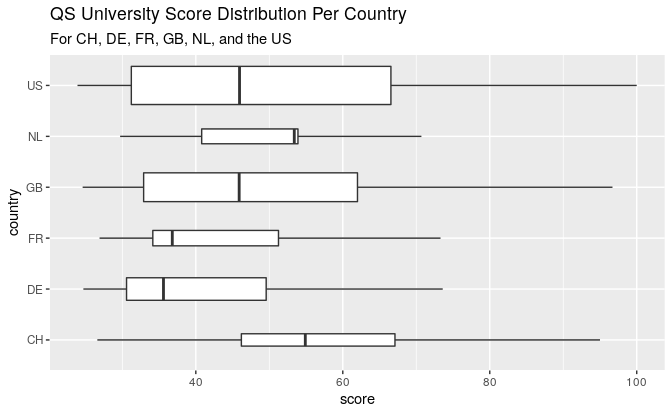

<!-- README.md is generated from README.Rmd. Please edit that file -->

# unirankings: Comparing University Rankings of Different Countries

<!-- badges: start -->

<!-- badges: end -->

Comparison of the distributions of QS university scores among a number
of countries.

## Introduction

## Data

  - [QS
    rankings](https://github.com/zambujo/unirankings/blob/master/data/qs.csv)
    from [QS World University
    Rankings 2020/21](http://www.topuniversities.com/university-rankings/world-university-rankings)

## Usage

  - Make sure you have the following libraries:

<!-- end list -->

``` r
library(tidyverse)
library(jsonlite)
library(janitor)
library(countrycode)
library(here)
library(conflicted)
```

> Optionally, sort out the most likely conflicts:

``` r
conflict_prefer('flatten', 'purrr')
conflict_prefer('filter', 'dplyr')
conflict_prefer('lag', 'dplyr')
```

  - To update the data, run [`R/read.R`](R/read.R);

  - To summarize the data by country, run [`R/logic.R`](R/logic.R).

## Result

``` r
df <- read_csv(here("data", "qs.csv"))
country_summary <- read_csv(here("data", "country_summary.csv"))
```

``` r
country_summary %>% 
  filter(count_score >= 5) %>% 
  arrange(desc(median_score)) %>%
  select(country, `n(scores)` = count_score, `med(score)` = median_score) %>%
  head(10) %>%
  knitr::kable()
```

| country | n(scores) | med(score) |
| :------ | --------: | ---------: |
| HK      |         6 |      75.05 |
| CH      |         9 |      54.90 |
| NL      |        13 |      53.40 |
| DK      |         5 |      51.00 |
| SE      |         8 |      48.85 |
| JP      |        16 |      48.15 |
| MY      |         8 |      48.05 |
| US      |        86 |      45.95 |
| GB      |        49 |      45.90 |
| BE      |         8 |      40.55 |

``` r
df %>% 
  filter(country %in% c("CH", "FR", "NL", "US", "GB", "DE")) %>%
  ggplot(aes(score, country)) +
  labs(
    title = "QS University Score Distribution Per Country",
    subtitle = "For CH, DE, FR, GB, NL, and the US") +
  geom_boxplot(varwidth = TRUE)
```



## License

`unirankings` is released under the [MIT License](./LICENCE.md).
